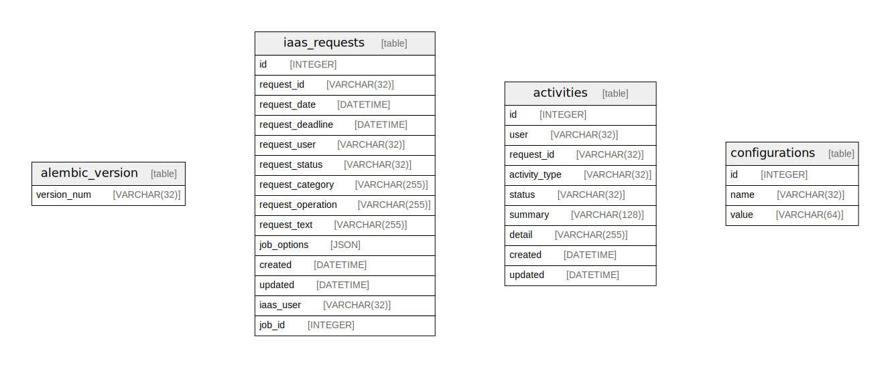

# iaas_requests.sqlite3

## Tables

| Name | Columns | Comment | Type |
| ---- | ------- | ------- | ---- |
| [alembic_version](alembic_version.md) | 1 |  | table |
| [iaas_requests](iaas_requests.md) | 14 |  | table |
| [activities](activities.md) | 9 |  | table |
| [configurations](configurations.md) | 3 |  | table |

## Relations

---

> Generated by [tbls](https://github.com/k1LoW/tbls)
