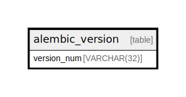

# alembic_version

## Description

<details>
<summary><strong>Table Definition</strong></summary>

```sql
CREATE TABLE alembic_version (
	version_num VARCHAR(32) NOT NULL, 
	CONSTRAINT alembic_version_pkc PRIMARY KEY (version_num)
)
```

</details>

## Columns

| Name | Type | Default | Nullable | Children | Parents | Comment |
| ---- | ---- | ------- | -------- | -------- | ------- | ------- |
| version_num | VARCHAR(32) |  | false |  |  |  |

## Constraints

| Name | Type | Definition |
| ---- | ---- | ---------- |
| version_num | PRIMARY KEY | PRIMARY KEY (version_num) |
| sqlite_autoindex_alembic_version_1 | PRIMARY KEY | PRIMARY KEY (version_num) |

## Indexes

| Name | Definition |
| ---- | ---------- |
| sqlite_autoindex_alembic_version_1 | PRIMARY KEY (version_num) |

## Relations



---

> Generated by [tbls](https://github.com/k1LoW/tbls)
