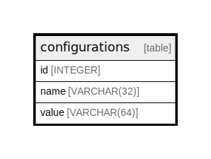

# configurations

## Description

<details>
<summary><strong>Table Definition</strong></summary>

```sql
CREATE TABLE configurations (
	id INTEGER NOT NULL, 
	name VARCHAR(32) NOT NULL, 
	value VARCHAR(64), 
	PRIMARY KEY (id)
)
```

</details>

## Columns

| Name | Type | Default | Nullable | Children | Parents | Comment |
| ---- | ---- | ------- | -------- | -------- | ------- | ------- |
| id | INTEGER |  | false |  |  |  |
| name | VARCHAR(32) |  | false |  |  |  |
| value | VARCHAR(64) |  | true |  |  |  |

## Constraints

| Name | Type | Definition |
| ---- | ---- | ---------- |
| id | PRIMARY KEY | PRIMARY KEY (id) |

## Relations



---

> Generated by [tbls](https://github.com/k1LoW/tbls)
