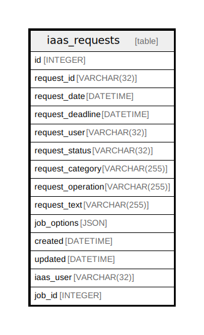

# iaas_requests

## Description

<details>
<summary><strong>Table Definition</strong></summary>

```sql
CREATE TABLE iaas_requests (
	id INTEGER NOT NULL, 
	request_id VARCHAR(32) NOT NULL, 
	request_date DATETIME NOT NULL, 
	request_deadline DATETIME NOT NULL, 
	request_user VARCHAR(32) NOT NULL, 
	request_status VARCHAR(32) NOT NULL, 
	request_category VARCHAR(255) NOT NULL, 
	request_operation VARCHAR(255) NOT NULL, 
	request_text VARCHAR(255) NOT NULL, 
	job_options JSON NOT NULL, 
	created DATETIME NOT NULL, 
	updated DATETIME NOT NULL, iaas_user VARCHAR(32), job_id INTEGER, 
	PRIMARY KEY (id)
)
```

</details>

## Columns

| Name | Type | Default | Nullable | Children | Parents | Comment |
| ---- | ---- | ------- | -------- | -------- | ------- | ------- |
| id | INTEGER |  | false |  |  |  |
| request_id | VARCHAR(32) |  | false |  |  |  |
| request_date | DATETIME |  | false |  |  |  |
| request_deadline | DATETIME |  | false |  |  |  |
| request_user | VARCHAR(32) |  | false |  |  |  |
| request_status | VARCHAR(32) |  | false |  |  |  |
| request_category | VARCHAR(255) |  | false |  |  |  |
| request_operation | VARCHAR(255) |  | false |  |  |  |
| request_text | VARCHAR(255) |  | false |  |  |  |
| job_options | JSON |  | false |  |  |  |
| created | DATETIME |  | false |  |  |  |
| updated | DATETIME |  | false |  |  |  |
| iaas_user | VARCHAR(32) |  | true |  |  |  |
| job_id | INTEGER |  | true |  |  |  |

## Constraints

| Name | Type | Definition |
| ---- | ---- | ---------- |
| id | PRIMARY KEY | PRIMARY KEY (id) |

## Relations



---

> Generated by [tbls](https://github.com/k1LoW/tbls)
